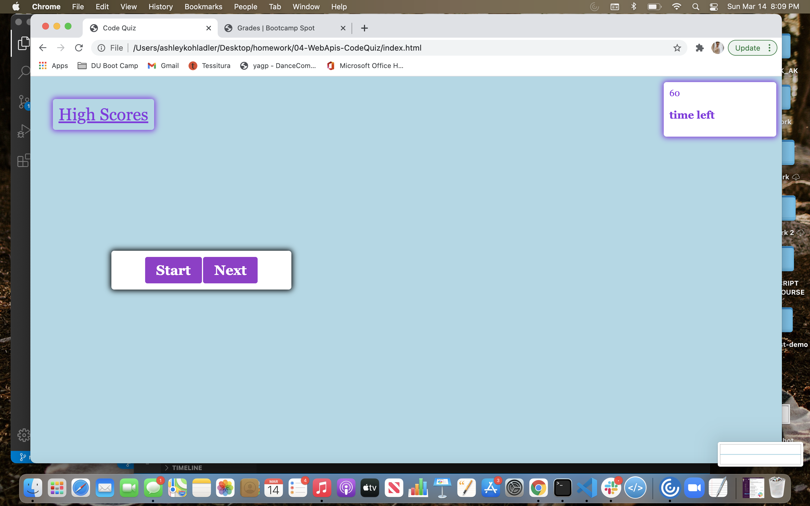

# 04-WebApis-CodeQuiz

# Homework 4

## Description of my work 

Play proceeds as follows:

The user arrives at the landing page and is presented with a call-to-action to "Start " Also note the navigation option to "View Highscores" and the "Time" value set at 0.

Clicking the "Start" button presents the user with a series of questions. The timer is initialized with a value and immediately begins countdown.

Score is calculated by time remaining. Answering quickly and correctly results in a higher score. Answering incorrectly results in a time penalty.

When time runs out and/or all questions are answered, the user is presented with their final score and asked to enter their initials. Their final score and initials are then stored in localStorage.

## Link to Website

 https://ashleykohladler.github.io/03-JavaScript-PasswordGenerator/

## Screenshot
